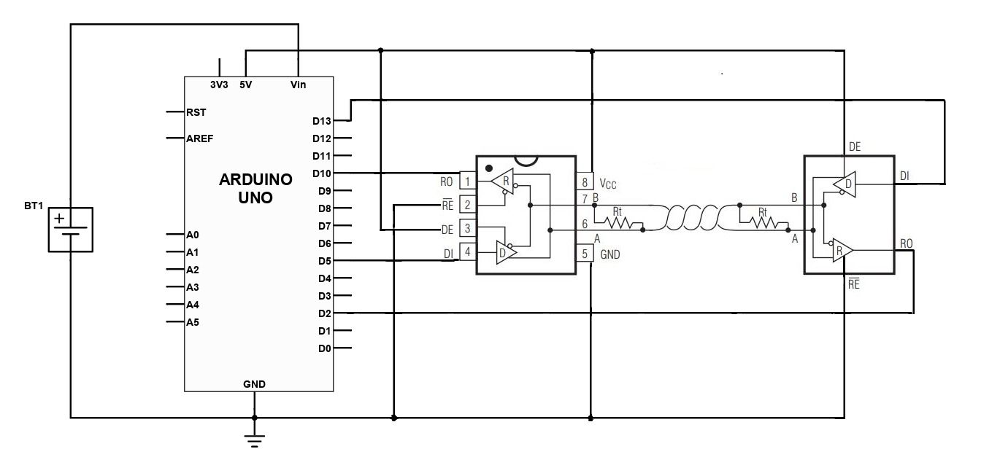

# Arduino CAN Interface library
---
The CAN (Controller Area Network) interface is a robust communication protocol that uses differential signal (CAN_H and CAN_L), which makes it highly resistant to electromagnetic interference (EMI) and noise, ensuring reliable data transmission even in harsh environments. CAN communication is considered "democratic" since the CAN bus is a broadcast type of bus. This means that all nodes can “hear” all transmissions, and each node can also send messages. This library implements V2.0A at up to 1 Mb/s, with 11-bit Identifiers only.
# Hardware:
---
You can use this library with either one or two Arduino boards together with two MAX485 modules, wired up as shown:

# Library usage
## Library Installation
---
1.Download the ZIP file from https://github.com/lolitaklva/arduino_can_library/tree/main -> Code -> Download ZIP  
2.From the Arduino IDE: Sketch -> Include Library... -> Add .ZIP Library...  
3.Restart the Arduino IDE  
## Init CAN  
---
To send or read a CAN message, create a CAN instance. Then, include the created instance as the first argument in the init() function. Additionally, provide the TX and RX pin numbers and the baud rate as the second, third, and fourth arguments, respectively.
### Example of Initialization
```cpp
CAN can_tx;
#define RX 4
#define TX 5
void setup() {
  can_tx.init(can_tx, RX, TX, 100);
}
```
## Write CAN  
---
To write a CAN message, use sendPacket() function. Provide the message id, set rtr to false and pass the data as arguments.
### Example
```cpp
can_tx.sendPacket(0b00001000110, false, 0b00110101);
```
## Read CAN  
---
To read a CAN message, use readPacket() function. You can additionally read any part of the CAN frame structure by using the following functions: get_id(); get_rtr(); get_ide(); get_dlc(); get_data(); get_crc_transmit(); get_crc_receive(); get_ack().
### Example 
```cpp
void loop() {
  can_rx.readPacket();

  if(can_rx.Complete_RX()) {
      uint8_t r_data = can_rx.get_data();
  }
  delay(2000);
}
```
## CAN frame structure
---
Library uses standard frame format with 11-bit identifier and 8-bit data length.
```cpp
can_frame = ((uint64_t)_identifier << 0);
can_frame |= ((uint64_t)_rtr << 11);
can_frame |= ((uint64_t)_ide << 12);
can_frame |= ((uint64_t)_dlc << 13);
can_frame |= ((uint64_t)_data << 17);
can_frame |= ((uint64_t)_crc << 25);
can_frame |= ((uint64_t)_crc_del << 40);
can_frame |= ((uint64_t)_ack << 41);
can_frame |= ((uint64_t)_ack_del << 42);
can_frame |= ((uint64_t)_eof << 43);
can_frame |= ((uint64_t)_ifs << 50);
```
# Library features
## Synchronization
---
The RX clock is synchronized with the TX clock on every transmission of a bit with an opposite logic level. A bit-stuffing algorithm is implemented to prevent prolonged sequences of identical logic levels on the bus. When a node transmits five consecutive bits of the same logic level, it adds a sixth bit of the opposite logic level to the outgoing bit stream. The receivers then remove this extra bit. Each bit is sampled at 75% of the main RX interrupt time to ensure accurate synchronization and reliable data reception.
## Error handling
---
The library implements a complex and reliable error-handling algorithm. There are six error flags with corresponding error-handling logic that accounts for the complexity of the CAN frame structure. Each node maintains two error counters: the Transmit Error Counter and the Receive Error Counter. Depending on its error history, a node can be error-active, error-passive (to avoid actively disrupting bus traffic), or in a 'bus-off' state, meaning it no longer participates in bus communication. A global error flag is set whenever any of the six possible errors are detected, ensuring that every node on the bus is aware of the issue and can react to it appropriately.